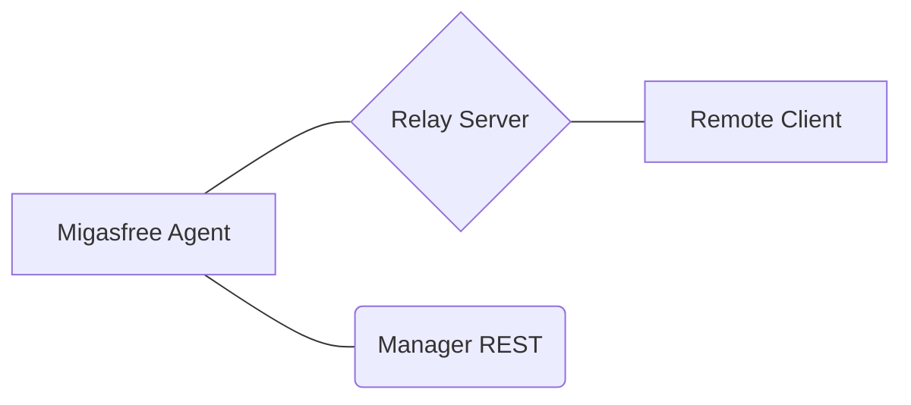

# Migasfree Agent

[](https://github.com/migasfree/migasfree-agent/actions/workflows/build.yml)
[](https://www.gnu.org/licenses/gpl-3.0)
[](https://www.python.org/downloads/)

**Migasfree Agent** is a multi-protocol TCP tunnel agent designed for secure remote access (SSH, VNC, RDP) via WebSocket tunnels. It uses **mTLS** (Mutual TLS) for secure, authenticated communication with the Migasfree Manager and Relay infrastructure.

## 🚀 Welcome to the Documentation

Following the **Diátaxis** framework, our documentation is organized into four main areas:

---

### 🎓 [Tutorials](./docs/tutorials/getting-started.md)

*Learning-oriented guides for newcomers.*

- **[Getting Started](./docs/tutorials/getting-started.md)**: Install and connect your first agent.
- **First Tunnel Setup**: Configure SSH/VNC for remote management.

### 🛠️ [How-To Guides](./docs/how-to/how-to.md)

*Problem-oriented guides for common tasks.*

- **[Platform Deployment](./docs/how-to/how-to.md#deploying-the-agent)**: Linux (Systemd) vs. Windows (NSSM).
- **[Development Setup](./docs/how-to/development.md)**: Environment, testing (Pytest), and linting (Ruff).
- **[Configuration](./docs/how-to/how-to.md#configuring-the-agent)**: Tailoring the agent for custom environments.
- **[Building from Source](./docs/how-to/how-to.md#building-from-source)**: Packaging your own `.deb` or `.rpm`.

### 📖 [Reference](./docs/reference/api.md)

*Information-oriented technical facts.*

- **[Python API](./docs/reference/api.md#python-logic-agent-core)**: Core classes and internal methods.
- **[WebSocket Protocol](./docs/reference/api.md#websocket-protocol-reference)**: Payload structure and message types.
- **[Default Constants](./docs/reference/api.md#static-configuration-constants)**: Intervals, timeouts, and whitelists.

### 🏗️ [Explanation](./docs/explanation/architecture.md)

*Understanding-oriented conceptual overviews.*

- **[Architecture](./docs/explanation/architecture.md)**: High-level design and Mermaid diagrams.
- **[Deep Dive: Tunnels](./docs/explanation/architecture.md#lifecycle-and-flows)**: How bridges are established.
- **Security Posture**: mTLS, command whitelists, and subprocess safety.

---

## 🏗️ Architecture Summary



The agent establishes a persistent WebSocket connection to a **Relay Server**, allowing bi-directional traffic between a **Remote Client** and a **Local Service** (like SSH or RDP), even behind strict corporate firewalls.

## 🧪 Quick Test

To run the agent in development mode:

```bash
pip install -e ".[dev]"
python migasfree_agent/agent.py
```

## 📜 License

This project is licensed under the **GNU General Public License v3.0** - see the [LICENSE](LICENSE) file for details.

---
Made with ❤️ by the Migasfree Team
