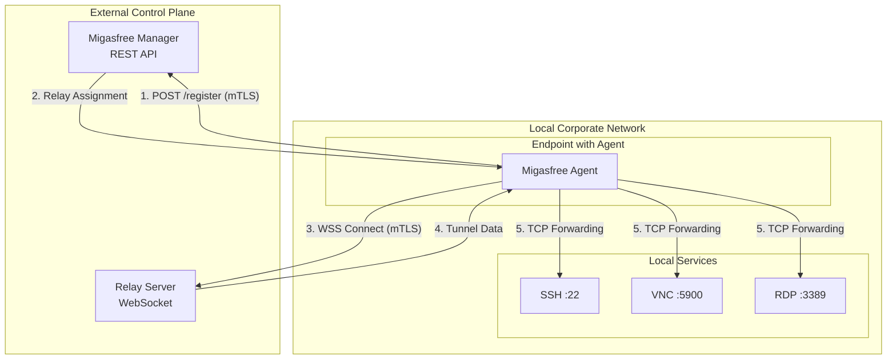
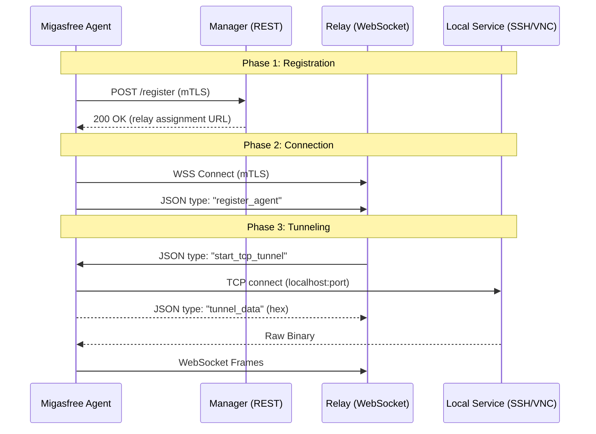
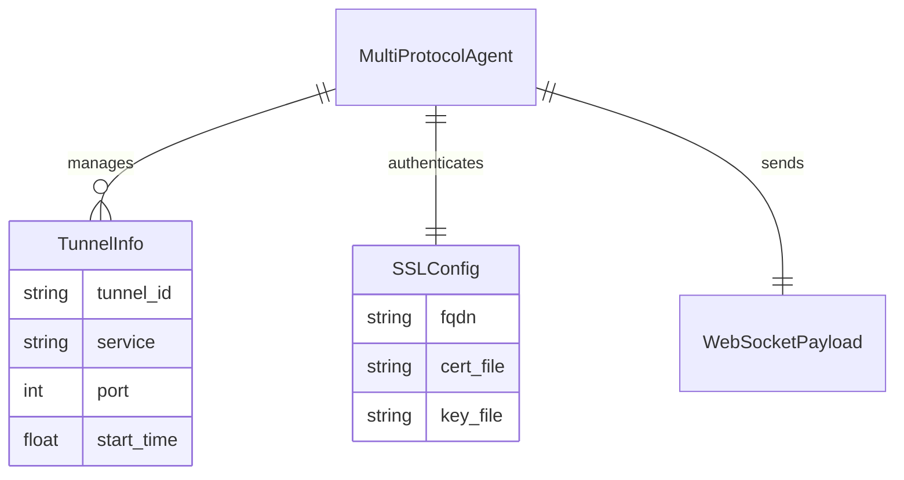
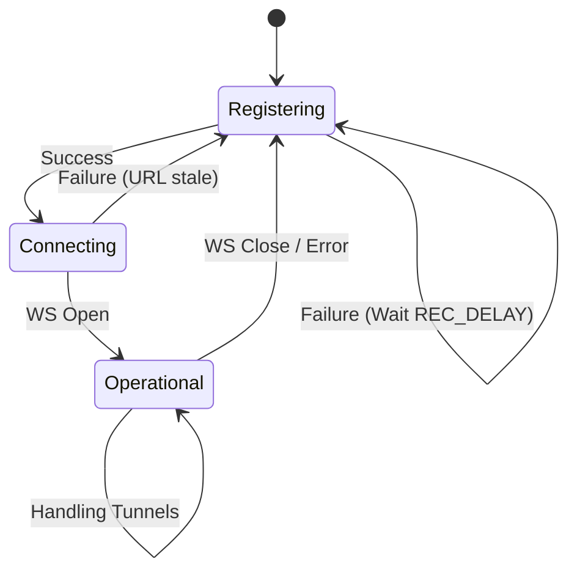

# Architecture: Deep Dive

This document explains the internal design and lifecycle of the Migasfree Agent. It's intended for developers and maintainers who want to understand how the agent bridges network boundaries using WebSocket tunneling.

## 🏗️ High-Level Component Model

The Migasfree Agent is an asynchronous Python application designed to create secure TCP tunnels through persistent WebSocket connections. It operates within a three-tier architecture comprising the **Manager** (for discovery), the **Relay** (for traffic routing), and the **Agent** itself.

### System Context

---

## 🔄 Lifecycle and Flows

### 🎢 Tunnel Establishment Flow

The agent's primary task is to maintain a state machine that transitions from discovery to tunnel operation.

---

## 📊 Data & State Model

### Entity-Relationship: Agent State

The agent maintains several logical entities to track its configuration and active tunnels.

---

## 🛡️ Security Posture

### mTLS Integrity

All communication is protected via **Mutual TLS (mTLS)**.

1. The Agent verifies the **Relay's certificate** against the configured CA.
2. The Relay verifies the **Agent's certificate** to ensure it belongs to a managed computer.
3. This creates a cryptographically secure "authenticated tunnel" where both ends of the WebSocket are verified identities.

### Command Execution

Remote commands are severely restricted:

- **Whitelist Enforcement**: The `ALLOWED_COMMANDS` list is the source of truth.
- **Subprocess Safety**: Arguments are never blindly passed to a shell; they are split and executed using standard `asyncio` subprocess utilities.

---

## 🚦 Error Handling & Resilience

### Reconnection Strategy

The agent implements an "infinite retry" loop with exponential backoff logic (simplified to a fixed delay currently) to ensure persistent connectivity.

### Connection Health & Heartbeat

To prevent "zombie" online statuses in Redis (e.g., when the agent crashes or experiences network failure without a clean disconnect), a cooperative heartbeat is active:

1. **Short-lived initial registration**: When the agent registers with the Manager, the record has a **120-second TTL**.
2. **Periodic WS Heartbeats**: While connected to the Relay WebSocket, the agent executes a background loop sending `register_agent` frames every **60 seconds**.
3. **Automatic Redis TTL Refresh**: The Relay handles these periodic frames to dynamically update the agent's Redis key TTL to **300 seconds**, maintaining its online status active. If the connection fails, the key naturally expires, ensuring high reliability of the remote access dashboard.

### Resource Cleanup

To prevent memory leaks and "zombie" connections:

- Every tunnel has a timeout for local port checks.
- Binary streams are explicitly closed when `tunnel_managed` messages arrive.
- Signal handlers (SIGTERM) ensure graceful shutdown and notification to the Relay.

### Unregistered Client Behavior

If the local machine is not yet registered with Migasfree:

1. **Missing Certificates**: No client mTLS keys (`cert.pem` and `key.pem`) exist in `/var/migasfree-client/mtls/`.
2. **Missing ID**: The official CLI commands (`migasfree --quiet info id`) fail to return a valid Computer ID (`CID`).

Under these conditions, the agent will throw a `RuntimeError` during startup. When run as a systemd service, this causes the service to exit. Systemd will continuously attempt to restart the agent (according to its restart policy). Once the machine is registered (e.g., after the first `migasfree sync`), the agent automatically recovers, initializes successfully, and connects to the Relay.
