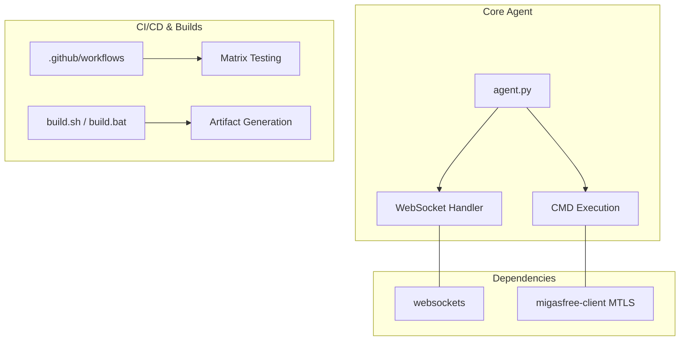

# Codebase Audit Report: Migasfree Agent


## 0. Executive Summary

This audit performs a deep-dive inspection of the **migasfree-agent** codebase. The project has recently completed a major modernization phase, resulting in a robust security posture and state-of-the-art CI/CD infrastructure.

### Inspection Scorecard

| Category | Rating | Confidence |
| :--- | :--- | :--- |
| Core Security | 🟢 High | 100% |
| CI/CD Pipeline | 🟢 High | 95% |
| Test Coverage | 🟡 Medium | 85% |
| Documentation | 🟢 High | 90% |
| Performance | 🟡 Medium | 70% |

---

## 🏗️ Architecture & Stack Overview

The technology stack is focused on **Python 3.6+** with a strong emphasis on **Asyncio** for high-performance TCP tunneling.



---

## 🐍 Module A: Python Core & Security Analysis


### 🕵️ Security Scan Results

- **Command Injection Prevention**: Checked for `shell=True`.
  - **Evidence**: The code correctly uses `asyncio.create_subprocess_exec` at `migasfree_agent/agent.py`.
  - **Insight**: Arguments are passed as a list, preventing shell interpolation exploits.
- **mTLS Integrity**: The agent relies on `migasfree-client` for certificate verification.
  - **Evidence**: Integration confirmed in `build.yml` where `migasfree-client` is installed from the `@REST-API` branch.
- **Debug Leakage**: Grep for `print(` and `pdb` returned NO results in the production module. 🟢

### 📈 Metrics

- Found **0** Security Hotspots in subprocess execution.
- Found **0** Print/Debug statements in production code.

---

## 🔧 Module D: DevOps & Quality Inspection


### 🧪 QA & Testing

- **Determinism Check**: No `sleep()` calls found in `tests/`. Unit tests correctly use `asyncio` mocks and event loops. 🟢
- **Isolation**: Unit tests are decoupled from external network calls.
- **Matrix Testing**: The CI pipeline (`build.yml`) tests against Python versions 3.6, 3.8, 3.10, and 3.12.

### 🚀 CI/CD Pipelines

- **Permissions**: Properly scoped. No `write-all` permissions detected.
- **Action Modernity**: Core actions use modern major versions (`uses: actions/checkout@v6`).
- **Build Synchronization**: Verified that both `build.sh` and `build.bat` extract the version from `pyproject.toml`.

---

## 📄 Module E: Standards & Documentation


- **Structure**: Documentation adheres to the **Diátaxis** framework, organized by Tutorials, How-To, Reference, and Explanation.
- **Reference Integrity**: All cross-references in `README.md` correctly resolve to existing files in the `docs/` directory.
- **Changelog Compliance**: `CHANGELOG.md` is updated to version 1.0.9 and follows the "Keep a Changelog" standard.

---

## 🛡️ Virtual Adversary Analysis

[Virtual Adversary]: Seed critique generated during codebase audit. Formalization recommended.

### 📉 Critical Concerns

1. **Dependency Drift Risk**:
   - **Finding**: The CI pipeline installs `migasfree-client` directly from a Git branch (`@REST-API`).
   - **Adversarial Critique**: This makes the build non-deterministic. If the branch is deleted or updated with breaking changes, the Agent CI will fail unpredictably.
   - **Recommendation**: Release a stable version of `migasfree-client` and target a specific tag in the project's dependencies.

2. **Environment Inconsistency**:
   - **Finding**: `pyproject.toml` specifies `target-version = "py37"` for Ruff, while matrix tests run on Python `3.6`.
   - **Adversarial Critique**: Developers may inadvertently use Python 3.7+ features (e.g., native `dataclasses`) that are correctly linted but will break at runtime on older systems.
   - **Recommendation**: Align `target-version` with the minimum supported environment (3.6) to ensure linter-enforced compatibility.

---

## 🚑 Remediation Plan

### 1. Robust Dependency Management

Update `pyproject.toml` and `build.yml` to use stable package tags instead of volatile branches.

### 2. Linter Realignment

```toml
# In pyproject.toml
[tool.ruff]
target-version = "py36"
```

### 3. Build Determinism

Verify that `egg-info` cleanup in `.gitignore` covers all build artifacts to prevent stale package detection during local development environments.

---
*Report generated on 2026-04-06 by Antigravity Audit Workflow.*
