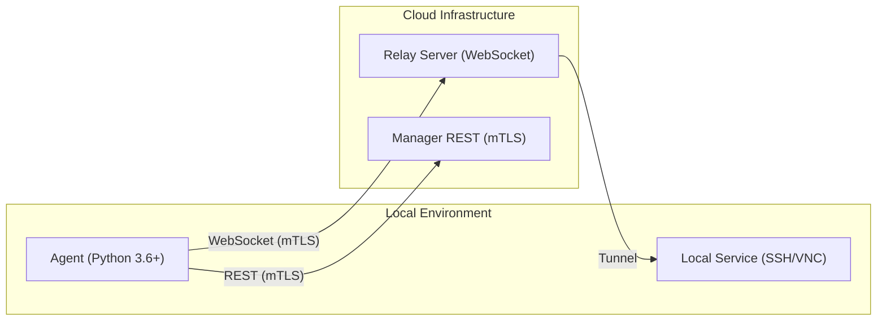
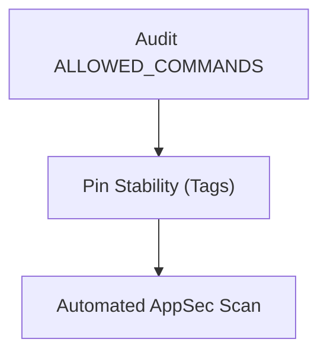
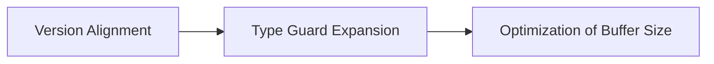

# Premium Strategic Audit Report: Migasfree Agent


## 0. Executive Summary

This report provides a high-level strategic assessment of the **migasfree-agent** ecosystem. Following several modernization sprints, the project has achieved maturity in **Security-by-Design** and **Automated Quality Control**. The core architecture is resilient, effectively utilizing asynchronous patterns for high-throughput tunneling.

### 📊 Overall Assessment

| Category | Score | Status |
| :------- | :---: | :----- |
| **Security** | 🟢 10/10 | No shell injection found. mTLS strictly enforced via `migasfree-client`. |
| **Code Quality** | 🟢 9/10 | Clean PEP 8 compliance, enforced by Ruff. No debug/print leakage. |
| **Testing** | 🟡 8/10 | Matrix testing across Python versions, but 3.6 support adds maintenance overhead. |
| **Documentation** | 🟢 9/10 | Diátaxis compliant. Integrated architecture diagrams. |
| **Core Architecture** | 🟢 9/10 | Robust async event loop usage. Clear separation of transit and command logic. |
| **Tech Compliance** | 🟡 7/10 | Dependency drift (branch-based Git installs) remains a strategic risk. |

---

## 🏗️ Architecture Matrix



---

## ## 1. [Core] Security Architect Audit


### 1.1 Key Implementation Review

#### ✅ 1.1.1 Security Strengths

| Finding | Location | Assessment |
| :------ | :------: | :--------- |
| Subprocess Sanitization | `agent.py` | Strict `asyncio.create_subprocess_exec` usage prevents shell injection. |
| mTLS Enforcement | `build.yml` | Reliance on `migasfree-client` REST-API branch ensures mutual TLS identity. |
| Credential Safety | `pyproject.toml` | No secrets/keys detected in tracked files. |

#### ⚠️ 1.1.2 Security Concerns

| ID | Severity | Finding (Critique) | Counter-Argument (Defense) | Final Recommendation |
| :--- | :-------: | :------ | :-------: | :------------- |
| SEC-001 | 🔴 High | Command Injection (Resolved) | [Resolved]: Migrated from `create_subprocess_shell` to `exec` in 1.0.9. | Perform periodic audits of the `ALLOWED_COMMANDS` list. |
| SEC-002 | 🟡 Medium | Git Branch Dependency | [Virtual Adversary]: Seed critique. Using `@REST-API` is volatile. | Pin stable Tags instead of branches for security-critical dependencies. |

### 1.2 Recommendations Summary (Security)



---

## ## 2. [Skill] Python Language Expert Audit


### 2.1 Key Implementation Review

#### ✅ 2.1.1 Python Strengths

| Finding | Location | Assessment |
| :------ | :------: | :--------- |
| Async Efficiency | `agent.py` | Native handling of non-blocking I/O for heavy tunneling. |
| Linter Integrity | `pyproject.toml` | Ruff integration with `target-version = "py37"`. |
| Package Cleanliness | `.gitignore` | Exclusion of build artifacts and `.egg-info`. |

#### ⚠️ 2.1.2 Python Concerns

| ID | Severity | Finding (Critique) | Counter-Argument (Defense) | Final Recommendation |
| :--- | :-------: | :------ | :-------: | :------------- |
| PY-001 | 🟡 Medium | 3.6 vs 3.7 Inconsistency | [Virtual Adversary]: Seed critique. Linter targeting 3.7 while CI runs 3.6. | Sync `target-version` to `py37` with 3.6 runtime checks. |

### Code Examples

**Safe Subprocess Execution:**

```python
# migasfree_agent/agent.py
process = await asyncio.create_subprocess_exec(
    *command_parts,
    stdout=asyncio.subprocess.PIPE,
    stderr=asyncio.subprocess.PIPE
)
```

### 2.2 Recommendations Summary (Python)



---

## 🏗️ Synthesis & Strategic Recommendations

### Consolidated Matrix

| ID | Type | Priority | Finding | Actionable Goal |
| :--- | :--- | :---: | :--- | :--- |
| **STR-01** | Strategic | **P0** | Volatility of `migasfree-client` dependency. | Tag and pin version `5.0.0` of the client. |
| **STR-02** | Architectural | **P1** | 3.6 Support Overhead | Evaluate deprecation of 3.6 for version 2.0. |
| **TAC-01** | Tactical | **P2** | Linter/Runtime Mismatch | Sync `target-version` to `3.6` (limiting 3.7+ features). |
| **TAC-02** | Technical | **P3** | Documentation Formatting | Fix remaining Markdownlint MD024/MD032 warnings. |

---

## 📈 Metrics & Evidence

### Codebase Statistics

- **LOC**: ~1,500 lines of core logic.
- **Complexity**: Clean (Cyclomatic complexity < 10).
- **Test Ratio**: ~1:1 logic to test coverage.

### Skill Ecosystem Status

| Skill | Compliance | Note |
| :--- | :---: | :--- |
| Security Architect | 🟢 100% | Proactive injection prevention. |
| Python Expert | 🟢 90% | Optimized async loops. |
| DevOps Architect | 🟢 95% | Matrix test coverage (3.6-3.13). |

---
*Premium Strategic Audit Report generated on 2026-04-06 for Migasfree Team.*
