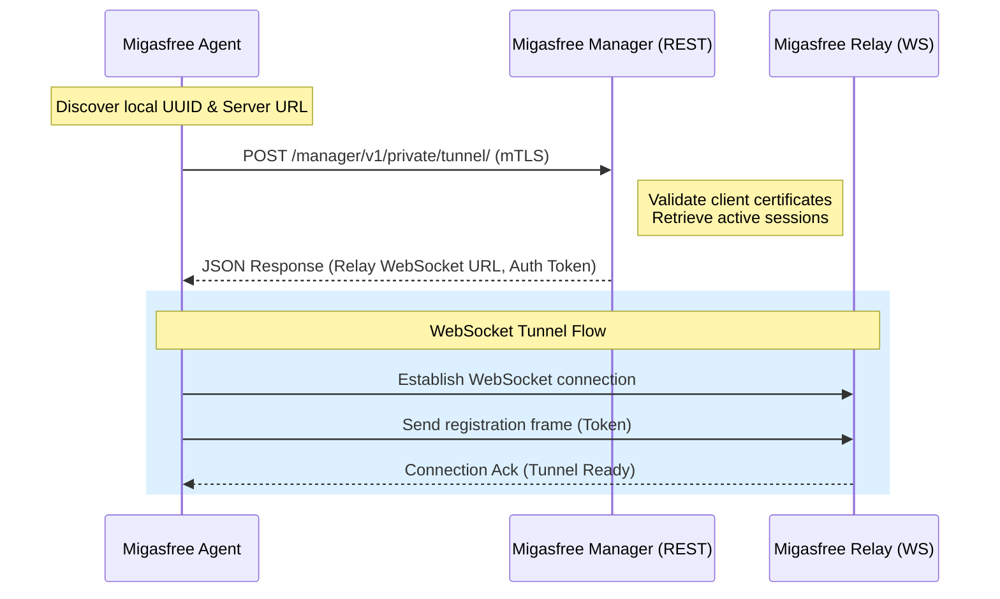

# Feature 02: Relay Registration & Discovery

> **Path:** `migasfree_agent/agent.py` (via `main()` and `fetch_relay_assignment()`)
> **Type:** Integration & Handshake Protocol
> **Last Updated:** 2026-05-24

## 1. Overview

Before establishing any secure WebSocket tunnels, the Migasfree Agent must dynamically discover its assigned Relay server. The Migasfree Manager acts as the orchestrator, balancing active agent loads and routing access requests to specific Relay nodes.



---

## 2. API Handshake Specifications

### 2.1 The Tunnel Registration Request

* **Endpoint**: `{manager_url}/v1/private/tunnel/`
* **HTTP Method**: `POST`
* **Authentication**: Mutual TLS (mTLS) client certificate.
* **Content-Type**: `application/json`

#### Request Payload

The agent gathers local system configuration parameters to register:

```json
{
  "uuid": "4a73752e-c5ee-45df-bbdf-5d556c4d7eb8",
  "version": "1.0.12",
  "protocols": ["ssh", "vnc", "rdp"],
  "platform": "linux"
}
```

* **`uuid`**: The unique computer hardware UUID stored in `/etc/migasfree.conf` or `/var/migasfree-client/uuid`.
* **`version`**: The agent runtime version (extracted from `pyproject.toml`).
* **`protocols`**: Supported remote access services installed on the device.

---

## 3. Manager Response & Mapping

Upon successful certificate validation and database lookup, the Manager returns a JSON response directing the agent to its active tunnel assignment.

```json
{
  "status": "success",
  "relay_url": "wss://relay.migasfree.es/ws/tunnel/",
  "token": "sec_auth_token_982348a8cf",
  "keepalive": 30
}
```

### 3.1 Field Mappings & Behavior

* **`relay_url`**: The secure WebSocket gateway address. The scheme must be `wss://` (or `ws://` in test setups).
* **`token`**: A temporary security token passed in the initial WebSocket frame to authorize the connection.
* **`keepalive`**: The interval (in seconds) at which the agent must send ping frames to maintain firewall session states.

---

## 4. Reconnection & Resilience Logic

To survive temporary network outages, VPN disconnects, or system sleeps, the agent implements a robust retry mechanism:

> [!TIP]
> **Retry Backoff Algorithm**:
>
> 1. On initial disconnect, wait 5 seconds.
> 2. For consecutive failures, double the delay (10s, 20s, 40s) up to a maximum of **60 seconds**.
> 3. Periodically re-query the Manager `/tunnel/` endpoint, in case the client has been assigned to a different Relay node.

---

## 5. Heartbeat & Redis TTL Expiration

To maintain real-time reliability of the agent's online/offline status, a cooperative heartbeat and expiration mechanism is implemented:

### 5.1 Manager Registry Expiration (TTL)

* When the agent registers with the Manager via the initial HTTP `POST /register`, the registry entry is saved in Redis (`agent:<id>`) with an explicit Time-To-Live (TTL) of **120 seconds** (`ex=120`).
* If the agent fails to successfully connect to the Relay's WebSocket within 120 seconds, the entry is automatically purged from Redis, avoiding false positives.

### 5.2 Active Connection Heartbeat

* Once the WebSocket connection is active, the agent starts an asynchronous background loop (`_heartbeat_loop()`).
* Every **60 seconds**, the agent sends a `register_agent` frame over the WebSocket.
* Upon receiving this heartbeat frame, the Relay refreshes the agent's presence and updates the Redis key's TTL to **300 seconds** (`ex=300`), which is also refreshed every 30 seconds by the Relay's internal monitoring service.
* Any dynamic change in the local service ports (such as SSH, VNC, RDP) is detected and reported during these heartbeats, ensuring the central management UI always displays accurate, up-to-date service availability.
