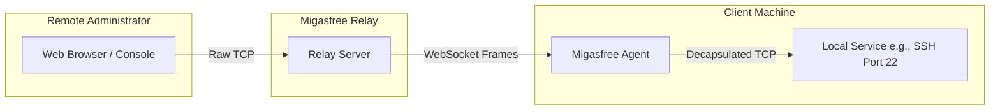

# Feature 03: WebSocket Tunneling Protocol

> **Path:** `migasfree_agent/agent.py` (via `MultiProtocolAgent` and `tunnel_handler`)
> **Type:** Networking & Stream Encapsulation
> **Last Updated:** 2026-05-24

## 1. Overview

The core function of the Migasfree Agent is to establish a secure reverse tunnel. It acts as a local proxy, receiving binary payload packets from a WebSocket stream, decapsulating them, and sending them to local loopback ports (SSH, VNC, RDP). Simultaneously, it reads from the local service sockets and encapsulates the streams into WebSocket frames.



---

## 2. Multi-Protocol Service Port Matrix

The agent listens to instructions from the Relay to target specific local services. The standard port mappings are:

| Protocol Name | Default Port | Target Local Service | Purpose |
|---------------|--------------|----------------------|---------|
| **SSH** | `22` | `/usr/sbin/sshd` | Secure remote shell access & file transfers |
| **VNC** | `5900` | Local VNC Server | Desktop screen-sharing (primarily Linux) |
| **RDP** | `3389` | Remote Desktop Service | Native Windows desktop sharing |

---

## 3. Tunnel Packet Protocol (JSON Frame Schemas)

All tunnel operations are multiplexed over a single WebSocket connection using a lightweight JSON framing protocol.

### 3.1 `tunnel_create` (Inbound Request)

The Relay instructs the agent to open a new connection to a local service:

```json
{
  "action": "tunnel_create",
  "tunnel_id": "c1f7b88e-4a6c-482a-bc96-189fdf2ab765",
  "protocol": "ssh"
}
```

* **`tunnel_id`**: Unique session UUID identifying this specific terminal or desktop session.
* **`protocol`**: The target service protocol. The agent dynamically routes to the corresponding port based on the matrix.

### 3.2 `tunnel_data` (Bi-directional Data Payload)

Payload frames encapsulate the raw TCP stream data, encoded as Base64:

```json
{
  "action": "tunnel_data",
  "tunnel_id": "c1f7b88e-4a6c-482a-bc96-189fdf2ab765",
  "data": "SGVsbG8gV29ybGQh..."
}
```

* **`data`**: Base64 encoded binary TCP payload. Upon receipt, the agent decodes this field and writes the raw bytes directly to the local service socket.

### 3.3 `tunnel_close` (Bi-directional Closure)

Sent by either the Relay (e.g. administrator closed the tab) or the Agent (e.g. SSH daemon terminated):

```json
{
  "action": "tunnel_close",
  "tunnel_id": "c1f7b88e-4a6c-482a-bc96-189fdf2ab765"
}
```

---

## 4. Connection Lifecycle & Memory Management

To maintain system stability and prevent resource leaks, the agent enforces strict controls:

* **Concurrency**: Multiple tunnels (e.g., an SSH terminal session and a VNC desktop stream) must run concurrently without blocking each other.
* **Socket Cleanup**: If a socket encounters an exception or close signal, the agent must immediately close the corresponding local TCP socket, remove the `tunnel_id` entry from the internal active tunnels dictionary, and send a `tunnel_close` notification to the Relay.
* **Stream Buffer Limits**: Frame sizes are strictly capped (default `10**7` bytes) to prevent memory exhaustion during heavy data transfers.
