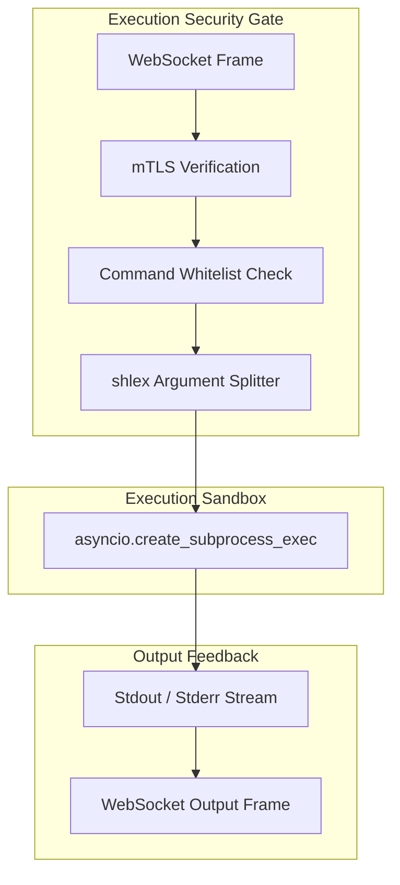

# Feature 04: Secure Remote Command Execution

> **Path:** `migasfree_agent/agent.py` (via `execute_command_handler` and `ALLOWED_COMMANDS`)
> **Type:** Execution Security & Real-Time Logging
> **Last Updated:** 2026-05-24

## 1. Overview

In addition to reverse TCP tunneling, the Migasfree Agent must support direct remote administrative command execution. This allows the central Manager to query agent diagnostics, trigger package updates, or run scripts. Since remote command execution is a high-risk capability, it is subject to rigorous security policies.



---

## 2. Security Controls & Shell Injection Defenses

The agent enforces multi-layered defenses to prevent unauthorized commands and arbitrary code execution:

### 2.1 The Allowed Commands Whitelist

Only explicitly approved commands are allowed to run.

* **Mechanism**: An immutable `frozenset` (`ALLOWED_COMMANDS`) specifies the commands the agent is authorized to execute.
* **Standard Whitelist**: `ALLOWED_COMMANDS = frozenset(['migasfree'])`
* **Handling Violations**: If an execution request specifies any binary not in the whitelist, the execution is immediately blocked, a warning log is generated, and an error frame is returned to the Relay.

### 2.2 Shell Injection Prevention

To eliminate the risk of argument-level shell injection (e.g. appending `; rm -rf /`), the agent strictly avoids shell invocation.

> [!CAUTION]
> **Strict Coding Rules**:
>
> * Never use `asyncio.create_subprocess_shell` or `subprocess.Popen(..., shell=True)`.
> * Always use `shlex.split()` to parse command parameters into a clean argument list.
> * Always invoke the binary directly using `asyncio.create_subprocess_exec` passing arguments as a list.

```python
# Secure Implementation Pattern
args = shlex.split(command_string)
process = await asyncio.create_subprocess_exec(
    args[0],
    *args[1:],
    stdout=asyncio.subprocess.PIPE,
    stderr=asyncio.subprocess.PIPE
)
```

---

## 3. Real-Time Output Streaming Protocol

Command execution output is streamed to the server in real-time, allowing administrators to monitor progress (such as active software downloads).

### 3.1 Payload Schemas

#### 3.1.1 `command_output` (Streaming Frame)

Sent periodically as the command prints output:

```json
{
  "action": "command_output",
  "execution_id": "e2f7b88e-4a6c-482a-bc96-189fdf2ab765",
  "stream": "stdout",
  "data": "Reading package list... 50%\n"
}
```

* **`stream`**: Identifies whether the data originated from `stdout` or `stderr`.
* **`data`**: Plaintext string containing the latest slice of command output.

#### 3.1.2 `command_completed` (Completion Frame)

Sent immediately after the subprocess terminates:

```json
{
  "action": "command_completed",
  "execution_id": "e2f7b88e-4a6c-482a-bc96-189fdf2ab765",
  "exit_code": 0
}
```

* **`exit_code`**: Subprocess return integer. An exit code of `0` denotes success, while non-zero represents failure.
